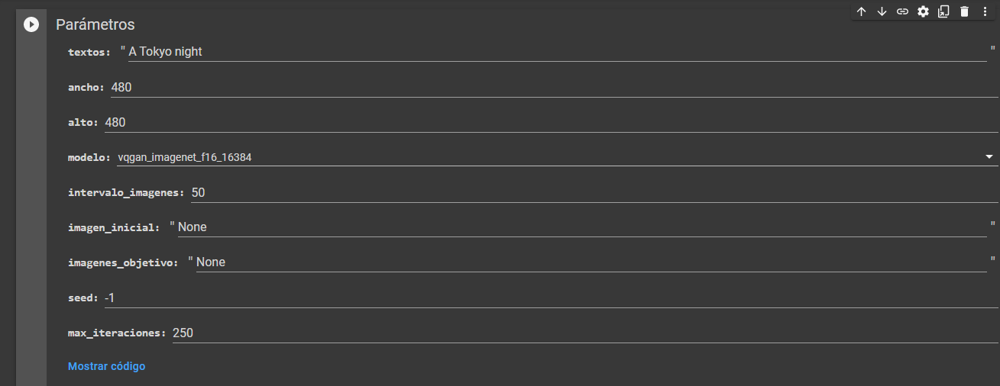
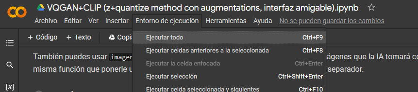
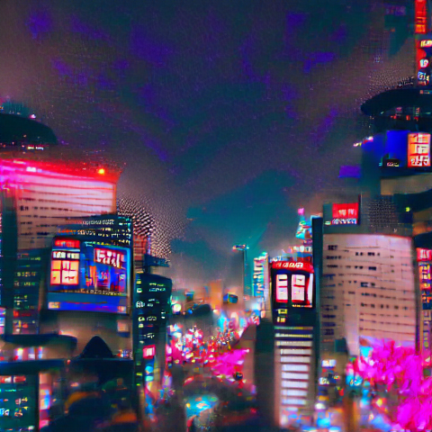
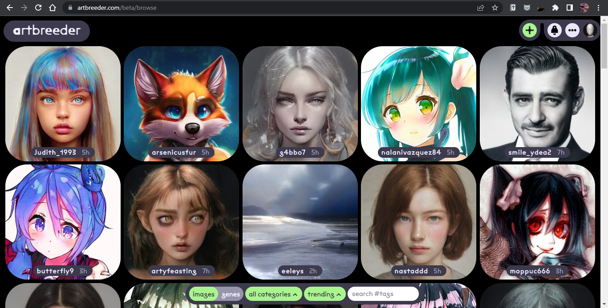
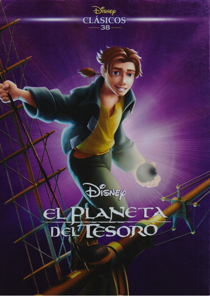
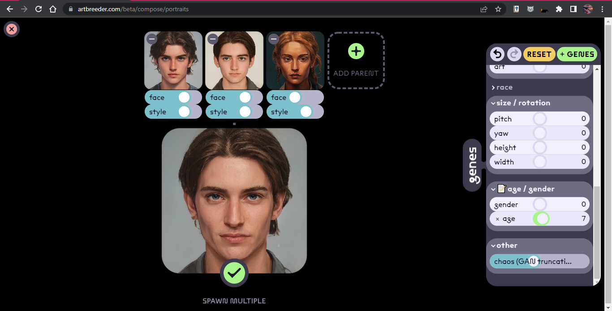
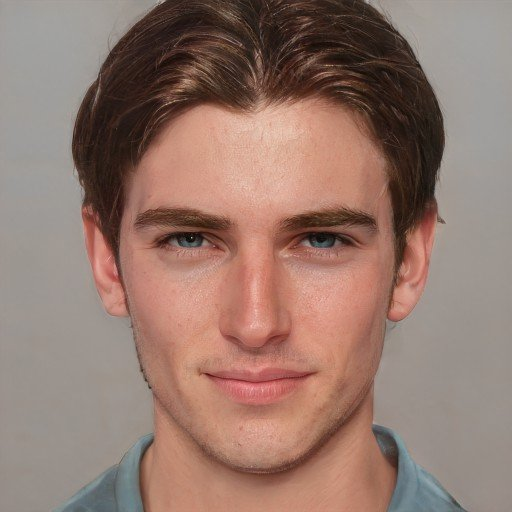

# Tercera Sesion: Introducción a la Inteligencia Artificial (IA)

En esta sesion aprendimos los conceptos necesarios para entender qué es una IA y la manera en que funciona, y realizamos dos practicas.

A diferencia de la programación tradicional, la IA en encarga de generar los modelos de analisis de datos, y existen 4 modos en los que la IA logra esto:

- Aprendizaje supervisado
- Aprendizaje semi-supervisado
- Aprendizaje no supervisado
- Algoritmos geneticos

#### Primera práctica

Esta consistió en el uso de una IA de aprendizaje no supervisado, la cual se puede acceder con este [link](https://colab.research.google.com/drive/1go6YwMFe5MX6XM9tv-cnQiSTU50N9EeT#scrollTo=CppIQlPhhwhs) y se encargará de generar un video en base de los parametros definidos.

En mi caso, la frase con la que decidí que la IA genere un video fue "A Tokyo night" (observar que el texto debe de estar en ingles), y el numero de iteraciones, que es igual al numero de fotogramas que la IA generará, fue de 250.

Finalmente es necesario presionar en "ejecutar todo" para que el video empieze a generarse.

El resultado final puede ser observado en este [link](https://twitter.com/plfc_07/status/1531416177779646464?s=20&t=ZwpJRvJO1VYS-ESoT8KkLw) y el fotograma final está a continuación.

Realmente me gusto mucho el resultado final.

#### Segunda práctica

En este caso, el objetivo generar una imagen con redes generativas antagonicas, es decir, que van "compitiendo" ente sí para ver cual genera un mejor resultado. Esta IA igual es del tipo de aprendizaje supervisado, ya que el usuario se encarga de descartar o aceptar los cambios. 

La pagina usada para esta practica es [_ArtBreeder_](https://www.artbreeder.com/) y la imagen debia de ser en base de un personaje 2D, del cual crearemos una versión realista basandonos en las imagenes que la pagina provee.

El personaje que seleccione para recrear es Jimm Hawkins, de la pelicula ["El planeta del Tesoro"](https://es.wikipedia.org/wiki/El_planeta_del_tesoro).

Esta es una captura del espacio de trabajo de la plataforma _ArtBreeder_.

Finalmente, este fue el resultado:

